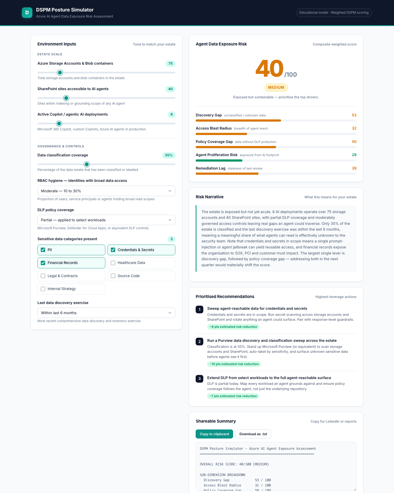

# DSPM Posture Simulator — Azure AI Agent Data Exposure Risk Assessment

A browser-based interactive tool that computes an **Azure AI agent data exposure risk score** across five weighted dimensions, driven entirely by environment parameters the practitioner supplies. It turns a conversation about agent-driven data exposure — _"how exposed are we if Copilot can reach across this estate?"_ — into a concrete score, a narrative, and a prioritised action list, without ever touching a live tenant.

> Designed as a practitioner's framing tool for security, GRC, and cloud-architecture conversations. Not a vendor demo, not a replacement for an actual DSPM assessment.

---

## Live Demo

**[https://sai-teja-girimaji.github.io/dspm-posture-simulator](https://sai-teja-girimaji.github.io/dspm-posture-simulator)**

No install, no signup, no telemetry. Open the link and start moving sliders.

---

## What It Assesses

The simulator decomposes overall exposure into five weighted sub-dimensions, each scored `0–100`:

| # | Dimension | What It Captures | Weight |
|---|-----------|------------------|--------|
| 1 | **Discovery Gap** | How much of the data estate is unclassified, unlabelled, and effectively unknown to the security team | 20% |
| 2 | **Access Blast Radius** | How broadly agents can reach sensitive data once invoked — a function of RBAC hygiene, estate scale, and agent footprint | 25% |
| 3 | **Policy Coverage Gap** | How much sensitive data sits outside the protection of DLP policies and egress controls | 20% |
| 4 | **Agent Proliferation Risk** | The exposure surface created by the number of active AI agents, amplified when surrounding controls are weak | 20% |
| 5 | **Remediation Lag** | How stale the last discovery exercise is — controls calibrated to yesterday's estate cannot govern today's | 15% |

The overall score is the weighted sum of these five dimensions.

---

## How To Use It

1. **Open the live URL** — [sai-teja-girimaji.github.io/dspm-posture-simulator](https://sai-teja-girimaji.github.io/dspm-posture-simulator).
2. **Adjust the sliders and dropdowns** on the left to reflect your Azure environment — storage scale, agent footprint, RBAC hygiene, DLP coverage, sensitive data categories, and time since the last discovery exercise.
3. **Read your risk score and breakdown** on the right — overall score, per-dimension bars, and a narrative paragraph that explains what the combination of inputs means in plain English.
4. **Review the top three prioritised recommendations** — each tailored to your inputs and tagged with an estimated point reduction.
5. **Copy the shareable summary** as text for LinkedIn, internal reports, board decks, or client conversations.

All computation happens client-side; the page state is ephemeral and never leaves your browser.

---

## Data Inputs

The simulator takes eight inputs:

1. **Number of Azure Storage Accounts and Blob containers** — slider, `1–500`.
2. **Number of SharePoint sites accessible to AI agents** — slider, `1–200`.
3. **Number of active Copilot / agentic AI deployments** — slider, `1–50`.
4. **Data classification coverage** — slider, `0–100%`.
5. **RBAC hygiene** — dropdown: Tight (<10%), Moderate (10–30%), Loose (30–60%), Ungoverned (>60%).
6. **DLP policy coverage** — dropdown: Full, Partial, Minimal, None.
7. **Sensitive data categories present** — multi-select: PII, Credentials & Secrets, Financial Records, Healthcare Data, Legal & Contracts, Source Code, Internal Strategy.
8. **Last data discovery exercise** — dropdown: Last 30 days, Last 6 months, Last year, Never.

---

## Risk Scoring

Each sub-dimension is computed from a weighted combination of the relevant inputs. The overall score is then a weighted sum of the five sub-dimensions (weights shown in the table above), producing a `0–100` composite.

The composite is mapped to four tiers:

| Score Range | Tier      | Meaning                                                        |
|-------------|-----------|----------------------------------------------------------------|
| `0 – 30`    | **Low**       | Defensible posture — maintain controls and cadence.            |
| `31 – 60`   | **Medium**    | Exposed but containable — prioritise the top drivers.          |
| `61 – 80`   | **High**      | Materially exposed — coordinated remediation required.         |
| `81 – 100`  | **Critical**  | Critical exposure — incident conditions present today.         |

Category sensitivity is factored in beyond a simple count: credentials and healthcare data carry a higher weight than internal strategy documents, reflecting real-world breach impact and regulatory exposure.

---

## Azure Stack Covered

The model is calibrated against the Microsoft Azure and Microsoft 365 control plane most commonly in scope for AI-agent data exposure:

- **Microsoft Entra ID** — identity hygiene, RBAC, agent service principals
- **Azure Blob Storage** — storage accounts and containers as primary data repositories
- **SharePoint Online** — agent-reachable content surfaces
- **Microsoft Copilot** — Microsoft 365 Copilot, custom Copilots, Azure AI agents
- **Microsoft Purview** — data discovery, classification, and labelling
- **DLP policies** — Purview DLP, Defender for Cloud Apps, and equivalent egress controls

---

## Disclaimer

This is an **educational tool** based on common DSPM frameworks and practitioner heuristics. It is **not a vendor product**, does not connect to any live Azure environment, and does not transmit, store, or analyse tenant data. Scores produced by the simulator are illustrative — they are a framing aid for risk conversations, not an audit substitute or a compliance attestation.

---

## Built With

- **Pure HTML, CSS, and vanilla JavaScript** — no frameworks, no build step.
- **No backend, no API keys, no telemetry** — fully client-side.
- **CDN dependency** limited to Google Fonts (Inter).
- **Deployable on GitHub Pages** as a single static `index.html`.
- **Built using [Claude Code](https://claude.com/claude-code)** — Anthropic's official CLI for agentic engineering.

---

## Author

**Sai Teja Girimaji**
Network Security Capability Lead at **NTT DATA**
Cloud security · AI security · Managed security services

GitHub — [github.com/sai-teja-girimaji](https://github.com/sai-teja-girimaji)
